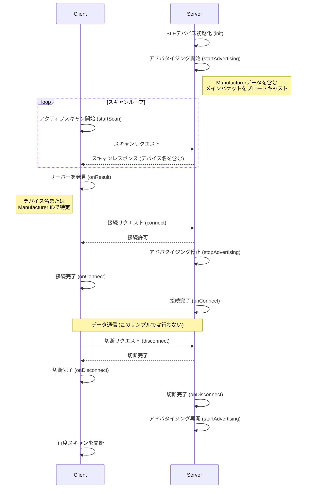

# ESP32 BLE Minimal Server and Client

このプロジェクトは、ESP32を2台使用して、BLE（Bluetooth Low Energy）通信の基本を学ぶための最小限のサンプルです。1台が「サーバー」（親機）、もう1台が「クライアント」（子機）として動作します。

## 概要

- **`minimal_ble_server`**: BLEサーバーとして、自身の存在を世界に知らせる（アドバタイズ）役割を担います。
- **`minimal_ble_client`**: BLEクライアントとして、特定のサーバーを探し出し（スキャン）、接続する役割を担います。

## 動作の仕組み

クライアントとサーバーは以下のような手順で通信を行います。

## 機能と実装の詳細

### サーバー (`minimal_ble_server.ino`)

サーバーは、クライアントからの接続を待ち受けるデバイスです。

-   **デバイス名**: `MINI_SERVER_NAME`
    -   `BLEDevice::init("MINI_SERVER_NAME");` で、自身のBLEデバイスにこの名前を付けています。

-   **アドバタイジング（広報）**:
    -   BLEデバイスは、アドバタイジング・パケットという小さなデータのかたまりを定期的に周囲に送信することで、自身の存在を知らせます。このプロジェクトでは、2種類のパケットを使い分けています。
    1.  **メインのアドバタイジングパケット**:
        -   ここには、`0xFFFF`というカスタムの**Manufacturer ID**（製造者ID）を含めています。これは、デバイスを特定するための「合言葉」のようなものです。
        -   `advData.setManufacturerData(...)` で設定しています。
    2.  **スキャンレスポンスパケット**:
        -   ここには、`MINI_SERVER_NAME`という**デバイス名**を含めています。
        -   クライアントが「もっと詳しく教えて」と要求（アクティブスキャン）したときにだけ返される追加情報です。
        -   `scanRes.setName(...)` で設定しています。
    -   このように情報を分けることで、常に送信されるメインパケットを小さく保ち、省電力で効率的なアドバタイジングを実現しています。

-   **コールバック（イベント処理）**:
    -   `MyServerCallbacks` クラスで、接続や切断といったイベントが発生したときの動作を定義しています。
    -   `onConnect`: クライアントが接続してきたら、シリアルモニタに「Connected」と表示し、アドバタイジングを停止します（接続中は他のデバイスに自分を知らせる必要がないため）。
    -   `onDisconnect`: クライアントが切断したら、「Disconnected」と表示し、再び他のクライアントが見つけられるようにアドバタイジングを再開します。

### クライアント (`minimal_ble_client.ino`)

クライアントは、特定のサーバーを探して接続しにいくデバイスです。

-   **スキャン**:
    -   `scanner->setActiveScan(true);` を設定することで、**アクティブスキャン**を実行します。これにより、サーバーからのスキャンレスポンスパケット（デバイス名を含む）も受信できます。
    -   `ScanCB` クラスの `onResult` メソッドで、デバイスが見つかるたびに以下の処理を行います。
    1.  **デバイス名での検索**: まず、`adv.getName().compare(DEVICE_NAME) == 0` で、見つかったデバイスの名前が `MINI_SERVER_NAME` と一致するかを確認します。一致すれば、それが探しているサーバーだと判断します。
    2.  **Manufacturer IDでの検索**: 名前で見つからなかった場合、次に `adv.getManufacturerData()` でManufacturer IDを確認し、`0xFFFF` と一致するかをチェックします。
    -   どちらかの方法でサーバーが見つかると、`scanner->stop()` でスキャンを停止し、接続処理に移ります。

-   **接続**:
    -   `loop()` 関数の中で、`shouldConnect` フラグが `true` になったら（＝サーバーが見つかったら）、`client->connect(address)` を呼び出してサーバーへの接続を試みます。

-   **コールバック（イベント処理）**:
    -   `ClientCB` クラスで、接続に関するイベントを処理します。
    -   `onConnect`: サーバーへの接続に成功したら、「Client: connected」と表示します。
    -   `onDisconnect`: サーバーとの接続が切れたら、「Client: disconnected → will rescan」と表示し、`loop()` 関数の中で自動的にスキャンが再開されるようにします。

## セットアップ

1.  **必要なもの**: ESP32開発ボードが2台必要です。
2.  **サーバーの準備**: 1台のESP32に、Arduino IDEなどを使って `minimal_ble_server/minimal_ble_server.ino` のスケッチを書き込みます。
3.  **クライアントの準備**: もう1台のESP32に、`minimal_ble_client/minimal_ble_client.ino` のスケッチを書き込みます。
4.  **動作の確認**: 両方のESP32をPCに接続し、Arduino IDEのシリアルモニタを開きます（ボーレートは115200）。クライアントがサーバーを見つけて接続し、切断すると再スキャンする様子がログで確認できます。

## プロジェクトで使われる定数

以下の定数は、サーバーとクライアントで同じ値を使うことで、お互いを正しく認識できるようにしています。

-   `DEVICE_NAME`: `"MINI_SERVER_NAME"` (サーバーのデバイス名)
-   `MANUFACTURER_ID`: `0xFFFF` (識別のためのカスタムID)