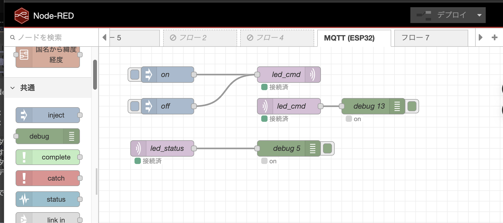

# ESP32 MicroPython MQTT LED制御プロジェクト

## 概要
ESP32（MicroPython）を使い、MQTT経由でLEDを制御するサンプルプロジェクトです。Node-REDを利用したフローも含まれています。

## 構成ファイル
- `led_control.py` : ESP32上で動作するLED制御用MicroPythonスクリプト。
- `wifi_config.py` : WiFi・MQTTブローカーの設定ファイル。
- `mosquitto.conf` : MQTTブローカー（Mosquitto）の設定例。
- `node-red-flow.json` : Node-RED用フロー定義ファイル。
- `node-red-flow.png` : Node-REDフローの全体図（画像）。
- `wifi_config-sample.py` : 設定ファイルのサンプル。

## Node-RED フローの説明
`node-red-flow.json` には、MQTTを介してLEDのON/OFF制御や状態取得を行うためのNode-REDフローが定義されています。

### 利用方法
1. Node-REDエディタで「インポート」から `node-red-flow.json` を読み込む。
2. MQTTノードの設定で、`mosquitto.conf` の内容に合わせてブローカー情報を設定。
3. フローをデプロイし、MQTT経由でLED制御が可能になります。


### Node-RED フローのスクリーンショット
下記は Node-RED フローの全体図です。



## セットアップ手順
1. 必要な設定を `wifi_config.py` に記入。
2. MosquittoなどMQTTブローカーを起動（`mosquitto.conf` 参照）。
3. ESP32にMicroPythonを書き込み、`led_control.py` をアップロード。
4. Node-REDでフローをインポートし、MQTTブローカーに接続。

## 参考
- MQTTトピック例：
  - LED制御コマンド: `esp32/led/cmd`
  - LED状態: `esp32/led/status`

---
ご不明点は各ファイルのコメントや設定例をご参照ください。

## macOS で Mosquitto をインストールし、コマンドラインで LED 制御・状態取得する手順

### Mosquitto のインストール
Homebrew を使って Mosquitto をインストールします。

```sh
brew install mosquitto
```

インストール後、Mosquitto サーバーを起動します。

```sh
brew services start mosquitto
```

### コマンドラインから LED 制御（ON/OFF）
MQTT の publish コマンドで LED を制御します。

LED ON:
```sh
mosquitto_pub -h <MQTT_BROKERのIP> -p 1883 -t esp32/led/cmd -m "on"
```

LED OFF:
```sh
mosquitto_pub -h <MQTT_BROKERのIP> -p 1883 -t esp32/led/cmd -m "off"
```

### コマンドラインから LED 状態の取得
MQTT の subscribe コマンドで LED の状態を取得します。

```sh
mosquitto_sub -h <MQTT_BROKERのIP> -p 1883 -t esp32/led/status
```

状態が変化すると、"on" または "off" のメッセージが表示されます。
