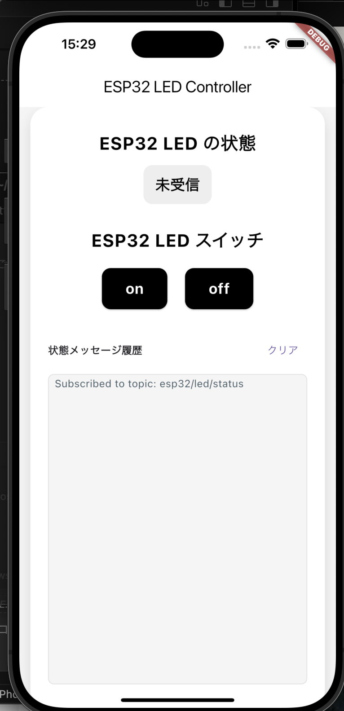

## ビルドと実行方法

このアプリのビルド・実行手順は以下の通りです。

1. 依存パッケージのインストール
	```sh
	flutter pub get
	```

2. アプリの実行（エミュレータまたは実機）
	```sh
	flutter run
	```

3. ビルド（apk/ipa/webなど）
	- Android:  `flutter build apk`
	- iOS:      `flutter build ios`
	- Web:      `flutter build web`

詳細は [Flutter公式ドキュメント](https://docs.flutter.dev/) を参照してください。
# MQTT_demo_app

Flutter を使った MQTT デモアプリです。

## はじめに

このプロジェクトは Flutter アプリケーションのサンプルとして作成されています。
MQTT プロトコルを利用した通信のデモを行うことができます。

## スクリーンショット



## 参考リンク

- [Flutter公式: はじめてのFlutterアプリ](https://docs.flutter.dev/get-started/codelab)
- [Flutter公式: サンプル集](https://docs.flutter.dev/cookbook)

Flutter開発の詳細は [公式ドキュメント](https://docs.flutter.dev/) を参照してください。
